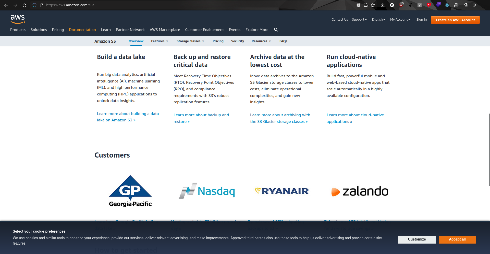
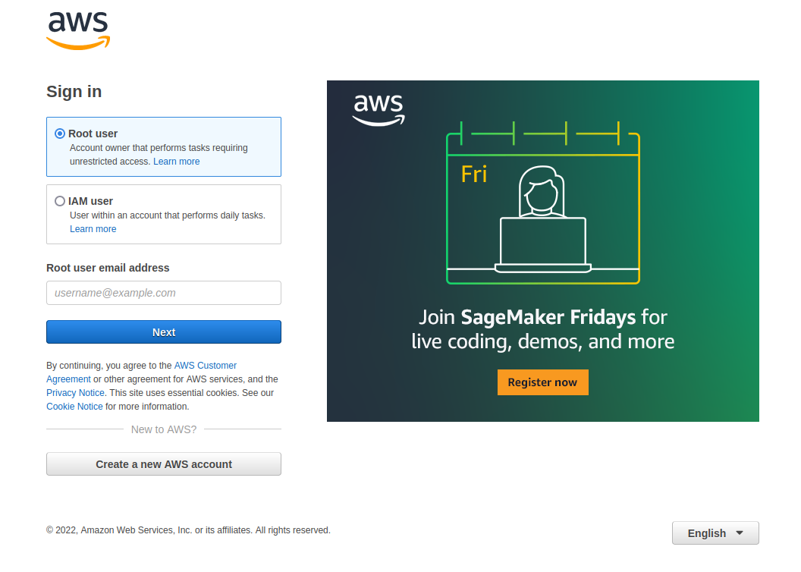
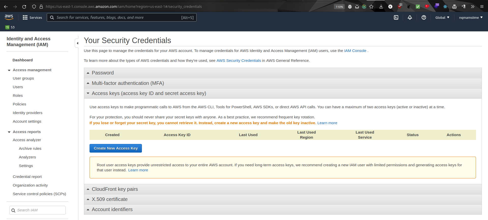

# Setup Guide

1. Sign in or create an account in AWS console
- https://console.aws.amazon.com

2. Get your Secret Access Key Id and Secret Access Key, save them in the following directory
- Create a folder and a file for your AWS credentials
  - `mkdir ~/.aws/ && touch ~/.aws/credentials`
- https://console.aws.amazon.com/iam/home?region=us-east-1#/security_credentials
- https://docs.aws.amazon.com/sdk-for-php/v3/developer-guide/guide_credentials_profiles.html

  
3. Run `composer install` in `/src/`.

4. In `src/config/Config.php` set your bucket's name (the `$bucketName` variable). 

5. Use `createBucket.php` to create a bucket. Syntax: `php createBucket.php`.

6. Use `createClientFolders.php` to create the client folders. Syntax: `php createClientFolders.php`.

7. Use `createClientConfigurations.php` to create the client configurations. Syntax: `php createClientConfigurations.php`.

8. Use `updateClientConfigurations` to update a particular configuration. Syntax: `php updateClientConfigurations.php`.

#### Dependencies:
- PHP Version: 8.0
- Composer Version 2

#### Note: Be careful about `'region' => 'us-central-1',` in `src/config.php`, use the one shown when you open `https://s3.console.aws.amazon.com/s3/buckets` (like in `https://s3.console.aws.amazon.com/s3/buckets?region=eu-central-1`, the `region=eu-central-1` part)